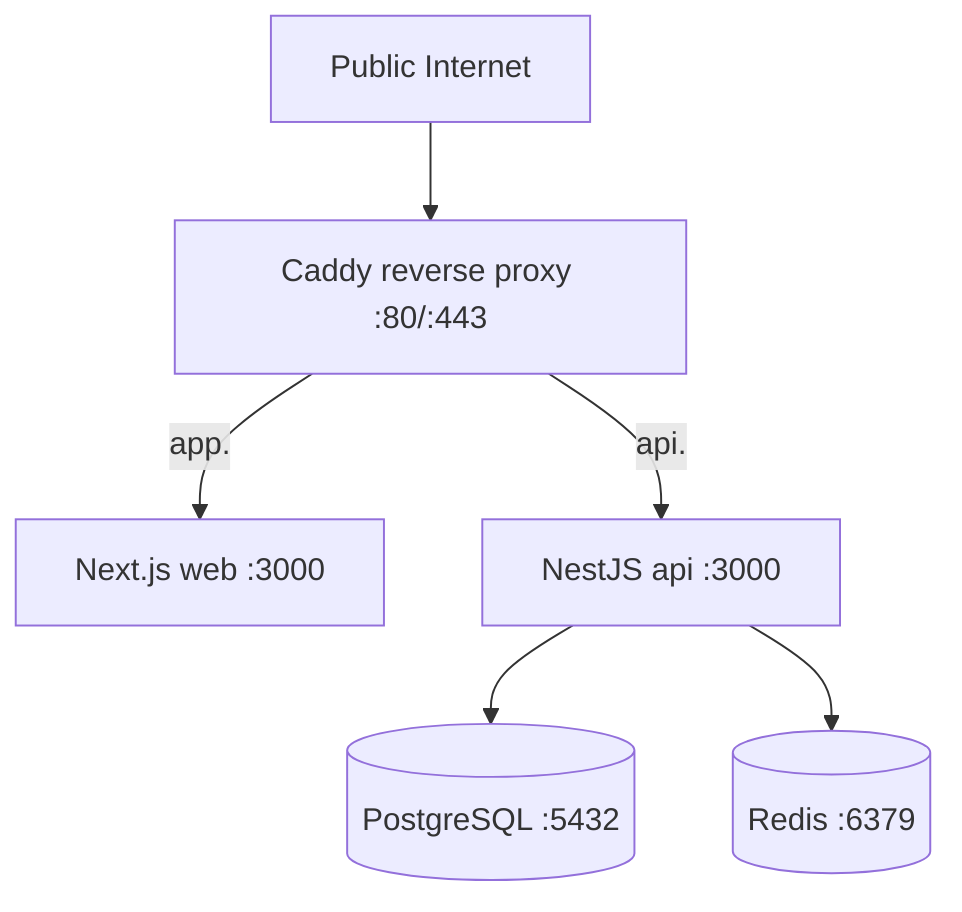

# MVP VM Deploy Plan (Liara Ubuntu + Docker Compose)

## Scope
This deployment targets MVP runtime services only:
- `proxy` (Caddy)
- `api` (NestJS)
- `web` (Next.js)
- `postgres`
- `redis`

Optional services are present but disabled by default via profiles:
- `worker`
- `object-storage`

## Topology

## Open Ports
- `22/tcp` SSH
- `80/tcp` HTTP (Caddy ACME + redirect)
- `443/tcp` HTTPS (Caddy TLS)

All other inbound ports blocked via UFW.

## Required Env Vars
Primary compose runtime vars are defined in `/opt/studio-platform/deploy/env/.env.compose`.

Critical keys:
- Routing/TLS: `APP_DOMAIN`, `API_DOMAIN`, `TLS_EMAIL`, `PUBLIC_WEB_URL`, `PUBLIC_API_URL`
- Data/auth: `POSTGRES_DB`, `POSTGRES_USER`, `POSTGRES_PASSWORD`, `DATABASE_URL`, `REDIS_URL`, `JWT_ACCESS_TOKEN_SECRET`, `JWT_REFRESH_TOKEN_SECRET`
- MVP mode flags:
  - `MVP_MODE=true`
  - `ENABLE_ADVANCED=false`
  - `FEATURE_MARKETPLACE_ENABLED=false`
  - `FEATURE_DISPUTES_ENABLED=false`
  - `FEATURE_PUBLIC_LAUNCH_ENABLED=false`
  - `FEATURE_PRICING_EXPERIMENTS_ENABLED=false`
  - `FEATURE_SUPPORT_ADMIN_ACTIONS_ENABLED=false`
  - `PUBLIC_MODULES_GLOBAL_KILL_SWITCH=true`

## Precheck Commands
- SSH reachability:
  - `ssh <deploy-user>@<vm-host> 'echo ok'`
- DNS checks:
  - `dig +short app.<domain>`
  - `dig +short api.<domain>`
- Dockerfile presence (now remediated in repo):
  - `test -f apps/api_nestjs/Dockerfile && echo api-ok`
  - `test -f apps/web_nextjs/Dockerfile && echo web-ok`

## Deploy Sequence
1. `git fetch --all --prune`
2. checkout pinned SHA (detached HEAD)
3. env validation (`scripts/deploy/vm/validate-env.sh`)
4. build `api` + `web` images on VM
5. start `postgres` + `redis`
6. run migrations and seed
7. start `api` + `web` + `proxy`
8. run smoke checks
9. persist deployed SHA state
10. emit deploy certification artifacts

## Rollback Strategy
- Deployment state tracks current and previous SHA in `/opt/studio-platform/deploy-state/`.
- `scripts/deploy/vm/rollback.sh` checks out previous SHA, rebuilds app images, restarts MVP services, reruns smoke checks.
- Database rollback is not automatic; restore from backups with `restore-db.sh` when required.
